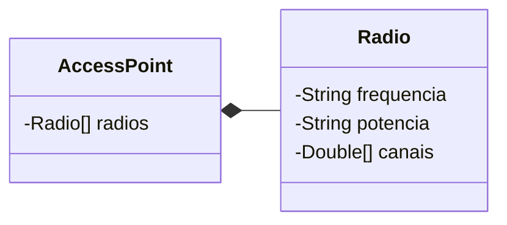
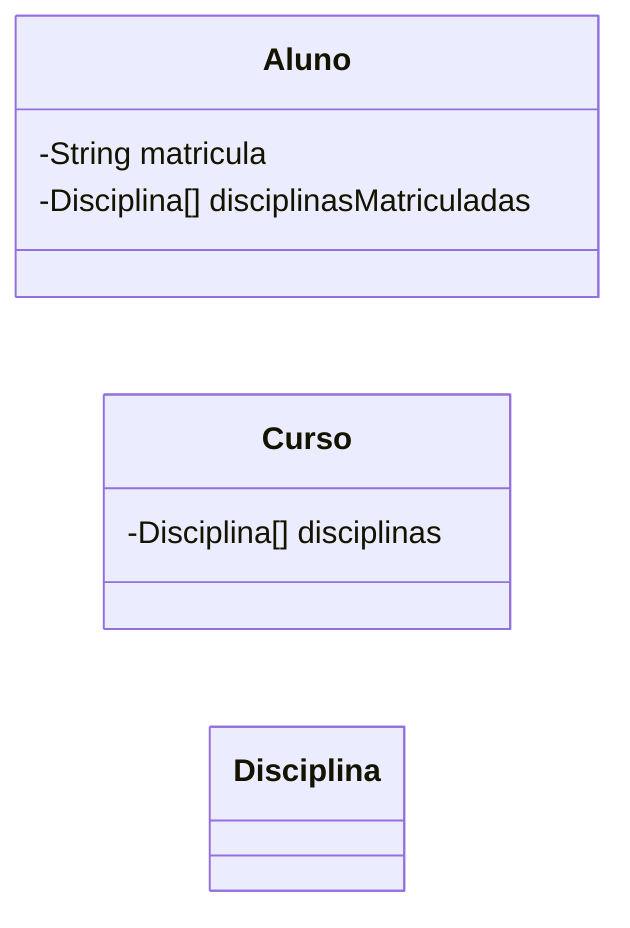

# PooUML

### Questão 01

```mermaid
classDiagram
    direction LR

    class AccessPoint {
        -Radio[] radios
    }

    class Radio {
        -String frequencia
        -String potencia
        -Double[] canais
    }

    AccessPoint *-- Radio

```

### Questão 02

```mermaid
classDiagram
    direction LR

    class Aluno {
        -String matricula
        -Disciplina[] disciplinasMatriculadas
    }

    class Curso {
        -Disciplina[] disciplinas
    }

    class Disciplina {

    }

```
